<h1 align="center">Reply</h1>

<p align="center">
  <a href="https://opensource.org/licenses/Apache-2.0"></a>
  <a href="https://android-arsenal.com/api?level=24"></a>
   <br>
  
  
  
  
</p>

<p align="center">
📬 Reply is the <a href="https://material.io/design/material-studies/reply.html">Material Study</a> email app,
rebuilt from the ground up in Compose Multiplatform — running on Android, iOS and Desktop (JVM) from a
single multi-module Kotlin codebase. Every screen and component of the original
<a href="https://github.com/material-components/material-components-android-examples/tree/develop/Reply">MDC-Android Reply</a>
sample is ported 1:1 (dimensions, type scale, colour roles, shapes and motion), with the View-based
widgets replaced by hand-built Compose components.
</p>

## Screenshots

| Home | Navigation drawer | Account picker | Swipe to star |
|:---:|:---:|:---:|:---:|
| 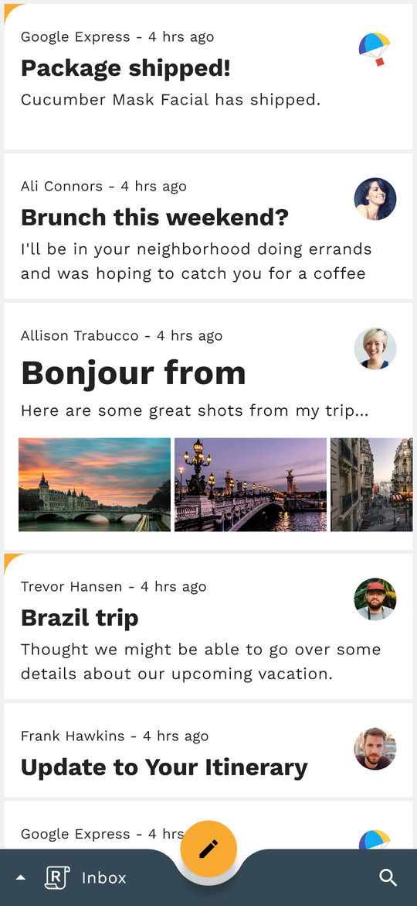 | 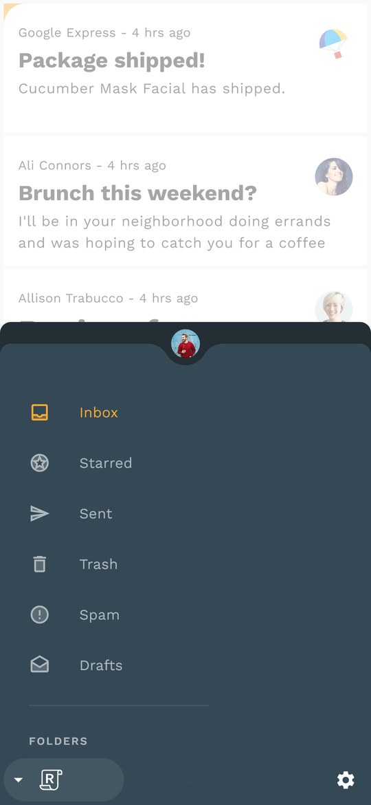 | 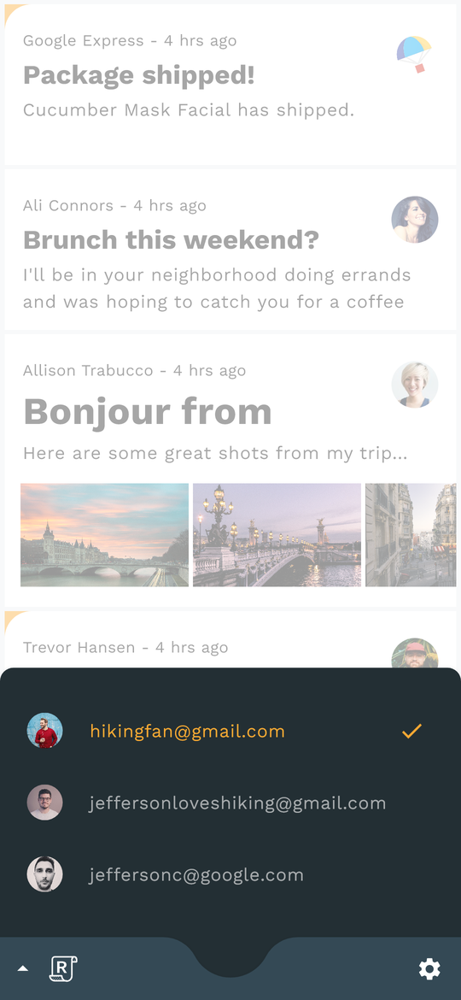 | 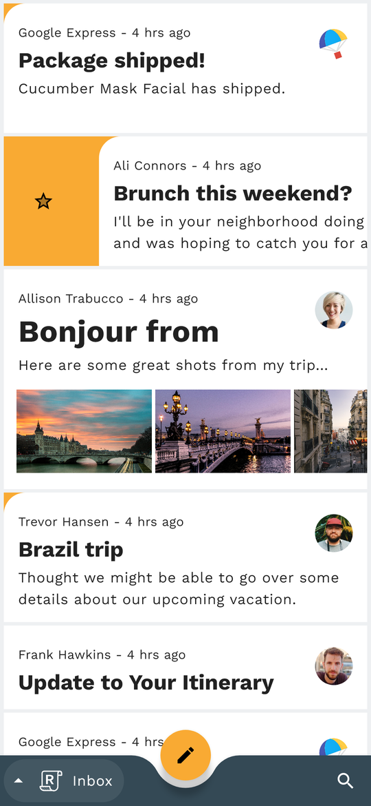 |

| Email (dark) | Compose (dark) | Search |
|:---:|:---:|:---:|
| 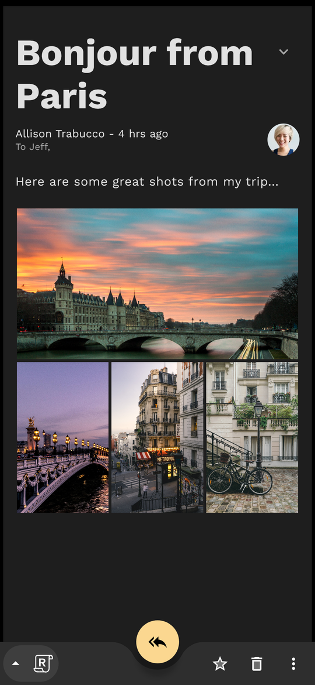 | 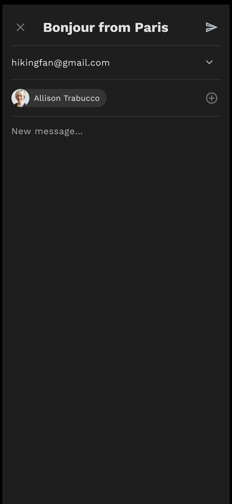 | 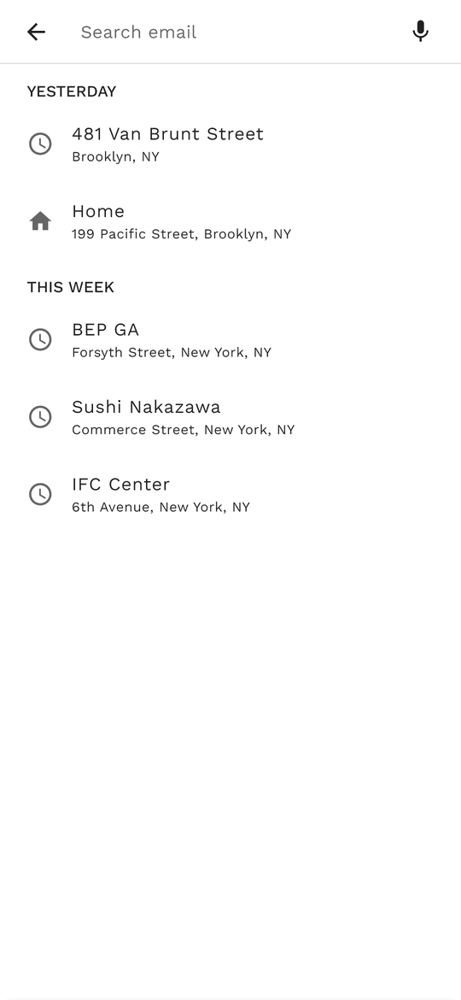 |

## Motion

Every transition of the Views app is reproduced with the same curves and timings
(`fast_out_slow_in`, 300 / 225 / 175ms, MDC's default container-transform thresholds,
`ViewDragHelper`'s quintic settle, `ItemTouchHelper`'s 250ms recover):

| Card → detail (`MaterialContainerTransform` + `MaterialElevationScale`) | FAB → compose (container transform, `Slide` return) | Drawer + account sandwich (`BottomSheetBehavior` physics) |
|:---:|:---:|:---:|
| 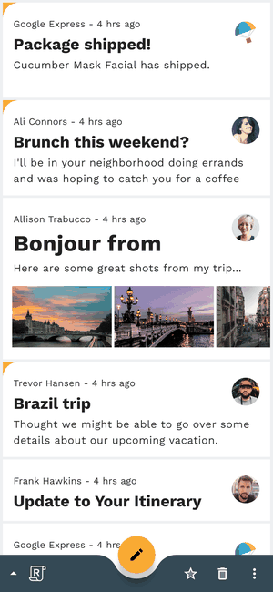 | 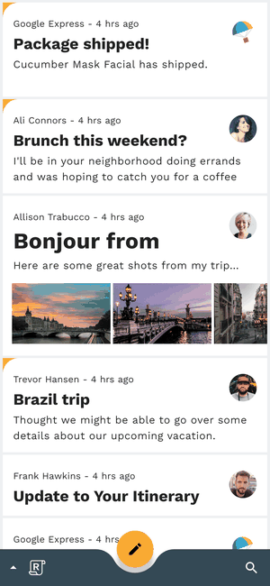 | 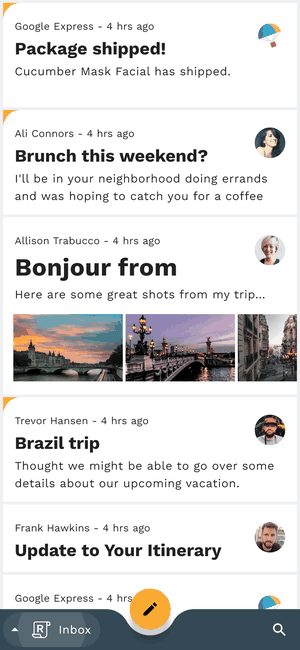 |

| Swipe to star (rebounding swipe, circular reveal) | Search (`MaterialSharedAxis` Z) | Mailbox switch (`MaterialFadeThrough`) |
|:---:|:---:|:---:|
| 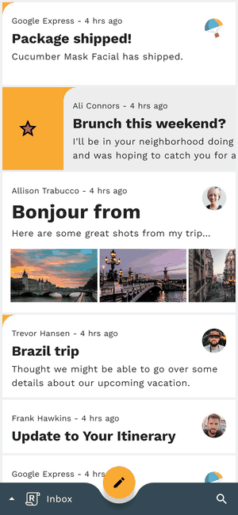 | 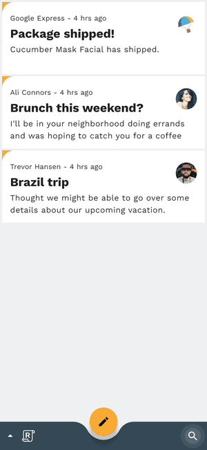 | 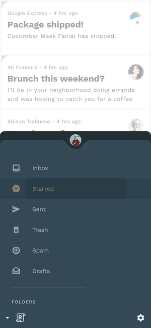 |

Motion is implemented in `:core:designsystem` → `motion/`: `MaterialMotion` (elevation scale, fade through,
shared axis Z, slide), `ContainerTransform` (a port of `MaterialContainerTransform`'s fit-mode /
fade-mode / threshold model), `Interpolators` (the platform interpolators), and `EditReplyIcon`
(the `avd_edit_to_reply` AnimatedVectorDrawable re-drawn on a Canvas).

## Running

- **Android** — `./gradlew :androidApp:assembleDebug`, or run the `androidApp` configuration in Android Studio.
- **Desktop** — `./gradlew :desktopApp:run`
- **iOS** — open `iosApp/iosApp.xcodeproj` in Xcode, set your signing **TEAM_ID** in
  `iosApp/Configuration/Config.xcconfig`, pick a simulator, and run.
- **Screenshots / motion frames** — `./gradlew :desktopApp:test --tests "*ScreenshotTest*"` renders every
  screen in both themes plus 16ms frames of each transition to `desktopApp/build/screenshots/`.

## What's ported

| Original (Views / MDC) | Compose Multiplatform |
|---|---|
| `Theme.Reply` / `Theme.Reply.Dark`, `TextAppearance.Reply.*` (Work Sans), `ShapeAppearance.Reply.*` | `ReplyTheme`, `ReplyColors`, `ReplyTypography`, `ReplyShapes` (`:core:designsystem`) |
| `BottomAppBar` with FAB cradle (`fabCradleMargin` 8dp, `fabCradleRoundedCornerRadius` 32dp) + `hideOnScroll` | `ReplyBottomAppBar` + `CutoutTopEdgeShape` (port of `BottomAppBarTopEdgeTreatment`), scroll-driven hide |
| `FloatingActionButton` with `asl_edit_reply` state list, `fab_show`/`fab_hide` animators | `ReplyFab` + `EditReplyIcon` (AVD morph), 175ms scale/opacity show-hide |
| `MaterialCardView` whose top-left corner morphs to 24dp when starred | `ReplyCard(topLeftCorner)` |
| `ReboundingSwipeActionCallback` + `EmailSwipeActionDrawable` (spring swipe, circular reveal, star bounce) | `Modifier.reboundingSwipe` + `EmailListItem` draw-behind |
| `BottomNavDrawerFragment`: `BottomSheetBehavior` (hideable, skipCollapsed, half ratio 0.6), `SemiCircleEdgeCutoutTreatment`, account "sandwich" | `BottomNavDrawer` + `BottomNavDrawerState` (anchored drag, nested scroll, sandwich animation) |
| `MenuBottomSheetDialogFragment` | `MenuBottomSheet` |
| `HomeFragment`, `EmailFragment` (masonry attachment grid), `ComposeFragment` (sender spinner, avatar chips, expanding recipient card), `SearchFragment` | `:feature:home`, `:feature:email`, `:feature:compose`, `:feature:search` |
| `MaterialContainerTransform` (card → detail, FAB → compose, chip → recipient card) | `ContainerTransform` overlay (`:core:designsystem/motion`) |
| `MaterialElevationScale`, `MaterialFadeThrough`, `MaterialSharedAxis(Z)`, `Slide` | `MaterialMotion` enter/exit transitions on the Nav3 back stack |
| `avd_edit_to_reply` FAB icon morph | `EditReplyIcon` (Canvas-drawn AVD timeline) |
| Dark-theme menu (Light / Dark / System default) | `ThemeMode` in `App` |

## Tech stack

- Kotlin Multiplatform, Compose Multiplatform (Material 3 primitives, custom Material 2–styled components).
- [Navigation 3](https://developer.android.com/guide/navigation/navigation-3) — type-safe `NavKey` back stack, `rememberDecoratedNavEntries` (saveable state + entry-scoped ViewModels); screens are switched by an `AnimatedContent` that carries the Material transitions.
- Lifecycle & ViewModel — `org.jetbrains.androidx.lifecycle`.
- [Metro](https://github.com/ZacSweers/metro) — compile-time DI (`@Inject`, `@AssistedInject`, `@DependencyGraph`).
- Compose Resources — Work Sans fonts, vector icons, avatars and photos shared across all targets.
- No network / database: `EmailStore` and `AccountStore` are in-memory `StateFlow`s, exactly like the sample.

## Architecture

```
:shared               # App shell: App, ReplyApp (Nav3 back stack + transitions, container transforms, bottom bar, drawer), Metro AppGraph
:core:data            # Account, Email, EmailAttachment, Mailbox, EmailStore, AccountStore (+ image resources)
:core:designsystem    # ReplyTheme, palette/type/shape/motion, custom components, cutout shape, fonts/icons
:feature:home         # Mailbox list, swipe-to-star, long-press menu
:feature:email        # Email detail with attachment grid
:feature:compose      # Compose/reply screen
:feature:search       # Search suggestions
:feature:nav          # Bottom navigation drawer + account picker
:androidApp / :desktopApp / iosApp
```

## Credits

Design and assets from the [Material Studies — Reply](https://material.io/design/material-studies/reply.html)
and the [material-components-android-examples](https://github.com/material-components/material-components-android-examples)
repository (Apache 2.0). Work Sans by Wei Huang (OFL).

## License

```
Copyright 2026 AndroidPoet

Licensed under the Apache License, Version 2.0 (the "License");
you may not use this file except in compliance with the License.
You may obtain a copy of the License at

   http://www.apache.org/licenses/LICENSE-2.0

Unless required by applicable law or agreed to in writing, software
distributed under the License is distributed on an "AS IS" BASIS,
WITHOUT WARRANTIES OR CONDITIONS OF ANY KIND, either express or implied.
See the License for the specific language governing permissions and
limitations under the License.
```
